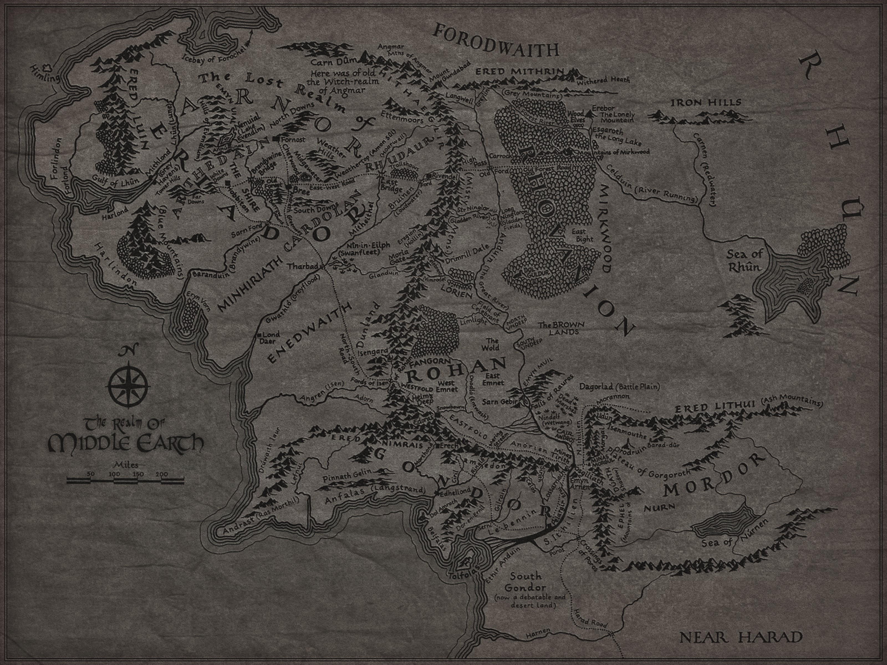

# The Lord of The Rings Project

This project is about visualisation of information relating to the Lord Of The Rings (lotr) books and films. This project covers character information, film information and information on the races and words in the lotr. I have used d3,dc and crossfilter libraries among others to show this information, and make it more   interactive and therefore user friendly.

## UX

The website is aimed at people various  people, of whom may have multiple interests. First there is fans of lotr  who would like to find out more information about lotr books and films, but do not wish to trawl through rows and columns of information. The idea was to create a single page website that allows a certain level of interactivity to get the viewer to be an active participant in the website. In the mock-ups I decided to create the first section of the website to have a black-background and a single image of the 'ring'. The concept behind this would be for users to be intrigued by such a minimalist introduction to the site and therefore they would want to see more.

The 'ring' would be a click function that would slowly bring up 

These fans or viewers who have interest in facts and knowledge can have an in depth look at various aspects of the films or words used in the stories in a quick and simple way. if people would like to look at stats for example on film budgets and revenues they can simply look at the bar graphs, as shown below.

